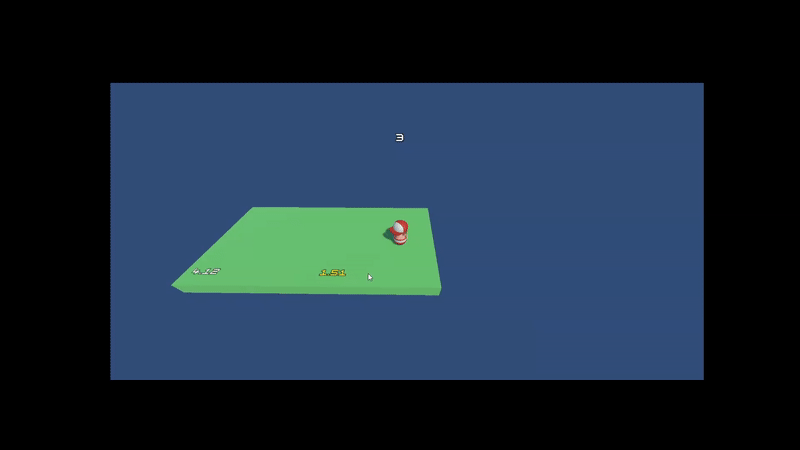

# 🏃‍♂️ Doofus & The Pulpit Gauntlet



**Doofus & The Pulpit Gauntlet** is a procedural 3D runner built in Unity. The player controls "Doofus," navigating through an endless stream of fading platforms ("Pulpits"). The goal is simple: survive as long as possible, manage your timing, and don't fall into the void!

---

## ⚠️ IMPORTANT: Developer Documentation

> **PLEASE CHECK THE IMPLEMENTATION FOLDER**
> 
> This README provides a general overview. For a detailed, chronological breakdown of the development process, coding challenges, architectural decisions, and the "Ideation to Execution" journey, **please read the `Implementation.md` file located in the `Implementation` folder.**
>
> 📄 **[Read the Full Implementation Log Here](./Implementation/Implmentation.md)**

---

## 🎮 Key Features

* **Procedural Generation:** "Pulpits" (platforms) spawn adjacently in random directions, creating a unique path every run.
* **Time-Attack Mechanics:** Each platform has a limited lifespan. Players must move to the next platform before the current one dissolves.
* **Configurable Gameplay (JSON):** Game settings (Player Speed, Spawn Times, Destroy Times) are loaded externally via JSON, allowing for game balancing without recompiling code.
* **Dynamic UI:**
    * Real-time Score HUD.
    * World-Space Canvas timers on every platform.
    * Start and Game Over/Restart screens.
* **Physics-Based Movement:** Custom character controller handling velocity, rotation, and **Jump mechanics**.
* **Audio & FX:** Integrated background music, scoring SFX, and game-over sounds. Code-driven animations (fading/shaking) for platform destruction.

---

## 🛠️ Technical Implementation

The project adheres to strict C# coding conventions and Unity best practices:

* **Namespace Architecture:** All scripts are encapsulated in the `DoofusGame` namespace to prevent conflicts and ensure modularity.
* **Singleton Pattern:** Used for `ScoreManager` and `AudioManager` to ensure centralized data management across scenes.
* **Coroutines:** utilized heavily for time-based events (Platform spawning logic, Text typing effects, UI Fades).
* **Data Persistence:** `GameSettingsLoader` deserializes JSON data to initialize game variables at runtime.
* **Input System:** Utilizes Unity's legacy `Input.GetAxis` for snappy, responsive arcade-style control.

### Core Script Structure
* `PulpitManager.cs`: Handles the logic for spawning adjacent platforms and managing the object pool.
* `PlayerMovement.cs`: Handles Rigidbody physics, jumping, and ground detection.
* `ScoreManager.cs`: Tracks scores and handles high-score logic.
* `GameSettingsLoader.cs`: Parsers `doofus_diary.json`.

---

## 🕹️ How to Play

### Controls
| Key | Action |
| :--- | :--- |
| **W / Up Arrow** | Move Forward |
| **S / Down Arrow** | Move Backward |
| **A / Left Arrow** | Move Left |
| **D / Right Arrow** | Move Right |
| **Spacebar** | **JUMP** |

### Rules
1.  **Start:** Click the "Start" button on the main menu.
2.  **Survive:** Move Doofus onto the next platform before your current platform's timer hits zero.
3.  **Score:** Every fresh platform you step on increases your score.
4.  **Game Over:** If you fall below the world threshold (-5 Y), the game ends.

---

## ⚙️ Configuration (JSON)

You can tweak the game difficulty by editing the `doofus_diary.json` file located in the `Assets` folder (or build folder):

```json
{
   "player_data" : {
     "speed" : 3
   },
   "pulpit_data" : {
     "min_pulpit_destroy_time" : 4,
     "max_pulpit_destroy_time" : 5,
     "pulpit_spawn_time" : 2.5
   }
}
```

## ⚙️ Also Find the Google Drive Link for the same 

https://drive.google.com/file/d/14dKQ3sUTfI9HKG629Qf9dRNV-fQ1w21C/view?usp=drive_link
